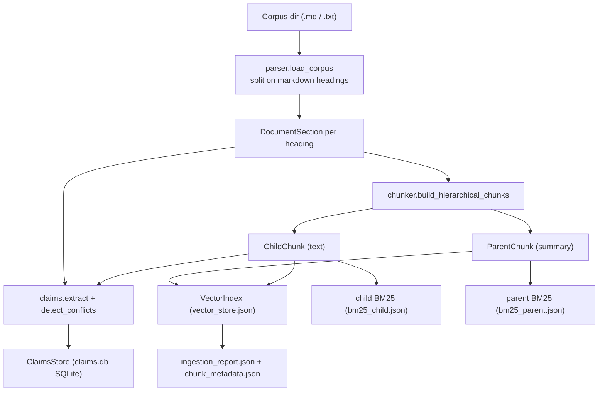
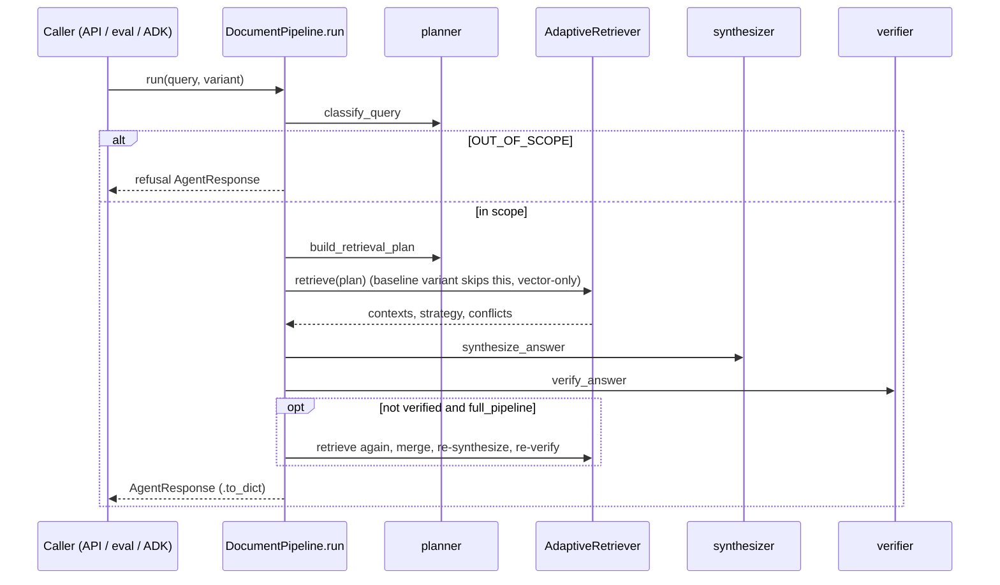

# GroundedDoc Developer Guide

This is an onboarding guide for a developer inheriting GroundedDoc. It assumes you
already understand the product goal (grounded, citation-backed document Q&A and
privacy-policy review) and that you are comfortable with Python, FastAPI, and RAG
concepts. It focuses on how the specific pieces fit together, where the bodies are
buried, and which conventions/anti-patterns to watch for.

Every claim below was verified against the source at the time of writing. Line
numbers can drift as the code changes; treat them as "verified at time of writing."

---

## 1. Orientation

GroundedDoc ingests a markdown corpus into a hierarchical index (parent summaries +
child chunks), extracts atomic "claims" and detects cross-document conflicts, then
answers queries through a router -> planner -> adaptive retriever -> synthesizer ->
verifier pipeline. Everything is traced in MLflow, gated in CI by custom scorers,
served via FastAPI, and exposed to end users through a Chrome extension that reviews
privacy-policy pages.

**The single most important thing to internalize on day one:** there are two
top-level packages with confusingly similar names that play very different roles.

- `grounded_doc_agent/` is the **actual Python library** (ingestion, retrieval,
  agents, eval, config, storage). This is where ~all real logic lives, and it is the
  only package installed by `pip` (see `[tool.setuptools.packages.find]` in
  [pyproject.toml](../pyproject.toml) lines 32-34, which includes only
  `grounded_doc_agent*`).
- `agents/grounded_doc/` is a **thin Google ADK web entrypoint**. It defines
  `root_agent` (a `SequentialAgent`) that wraps three library functions as tools. It
  is discovered by `adk web agents`, not by `pip`.

The README spells out the trap explicitly: when you run `adk web agents` you must
select `grounded_doc` (the ADK entrypoint), **not** `grounded_doc_agent` (the
library) - see [README.md](../README.md) lines 41-51.

```text
GroundedDoc/
  grounded_doc_agent/   <- the library (import this)
  agents/grounded_doc/  <- the ADK web entrypoint (run this with `adk web`)
```

---

## 2. Repository map

There are 60 tracked files. Grouped by role:

| Area | Paths |
| --- | --- |
| Packaging / config | [pyproject.toml](../pyproject.toml), [.env.example](../.env.example), [grounded_doc_agent/config/settings.py](../grounded_doc_agent/config/settings.py) |
| Data model | [grounded_doc_agent/models.py](../grounded_doc_agent/models.py) |
| Ingestion | [grounded_doc_agent/ingestion/](../grounded_doc_agent/ingestion/) (`parser.py`, `chunker.py`, `claims.py`, `pipeline.py`, `overlay.py`, `cli.py`) |
| Retrieval | [grounded_doc_agent/retrieval/](../grounded_doc_agent/retrieval/) (`vector_index.py`, `bm25.py`, `claims_store.py`) |
| Agents / query layer | [grounded_doc_agent/agents/](../grounded_doc_agent/agents/) (`pipeline.py`, `planner.py`, `retriever.py`, `synthesizer.py`, `analyze.py`, `tools.py`) |
| Evaluation | [grounded_doc_agent/eval/](../grounded_doc_agent/eval/) (`run_eval.py`, `scorers.py`, `golden_dataset.json`) |
| Storage | [grounded_doc_agent/storage/backend.py](../grounded_doc_agent/storage/backend.py) |
| API | [api/main.py](../api/main.py) |
| ADK entrypoint | [agents/grounded_doc/agent.py](../agents/grounded_doc/agent.py) |
| Browser extension | [extension/](../extension/) (`manifest.json`, `content.js`, `popup.js`, `popup.html`, `popup.css`) |
| Infra / deploy | [infra/Dockerfile](../infra/Dockerfile), [infra/cloudbuild.yaml](../infra/cloudbuild.yaml), [scripts/deploy_cloud_run.sh](../scripts/deploy_cloud_run.sh) |
| CI | [.github/workflows/ci.yml](../.github/workflows/ci.yml) |
| Tests | [tests/](../tests/) (`conftest.py`, `test_pipeline.py`, `test_analyze.py`, `test_api_auth.py`, `test_chunker.py`, `test_scorers.py`) |
| Sample corpus | [data/corpus/](../data/corpus/) (GDPR/PIPEDA/ACME summaries, `regulatory/` requirement cards, FastAPI docs) |
| Docs | [docs/architecture.md](architecture.md), this file |

Note there is **no** `agents/__init__.py` (only `agents/grounded_doc/__init__.py`,
which does `from . import agent`). `agents/` is an ADK agents directory, not a Python
package you import.

---

## 3. Core data model

All cross-module data structures are plain `@dataclass`es in
[grounded_doc_agent/models.py](../grounded_doc_agent/models.py). There are no Pydantic
models here (Pydantic is only used for FastAPI request bodies in `api/main.py`).

- Two string enums drive routing: `QueryType` (`LOOKUP`, `COMPARE`, `MULTI_HOP`,
  `SUMMARIZE`, `OUT_OF_SCOPE`) and `RetrievalStrategy` (`vector`, `bm25`, `claims`,
  `multi_hop`, `parent`).
- The hierarchical index is `ParentChunk` (a section summary, holds `child_ids`) and
  `ChildChunk` (the retrievable text unit, holds `parent_id`).
- `Claim` / `ClaimConflict` model extracted facts and cross-document disagreements.
- `RetrievalPlan` is the planner's output; `RetrievedContext` is the unit returned by
  every retriever; `AgentResponse` is the final serializable result (`to_dict()` is
  what the API and eval return).

Because these are dataclasses, persistence relies on `__dict__` round-tripping (see
`save_metadata`/`load_metadata` in
[vector_index.py](../grounded_doc_agent/retrieval/vector_index.py) lines 122-138 and
the BM25 serializer in [bm25.py](../grounded_doc_agent/retrieval/bm25.py) lines
87-91). If you add a required field to `ChildChunk`/`ParentChunk`, you must rebuild
the on-disk indexes or loading will raise on the missing constructor argument.

---

## 4. Ingestion pipeline



The orchestrator is `IngestionPipeline` in
[ingestion/pipeline.py](../grounded_doc_agent/ingestion/pipeline.py). Two entry paths:

- `run()` (lines 35-86): full rebuild from the corpus directory. Clears the claims
  store, re-embeds everything, and writes all artifacts. Driven by the CLI.
- `ingest_document()` / `remove_document()` (lines 88-149): dynamic "overlay" used by
  the `/analyze` flow to temporarily add a single user-supplied policy, then remove
  it. `ingest_document` first removes any existing doc with the same id (idempotent),
  appends to the in-memory indexes, and rebuilds conflicts.

Stages:

- **Parsing** ([parser.py](../grounded_doc_agent/ingestion/parser.py)): markdown is
  split on `^#{1,6}` headings via a single regex (line 9). Content before the first
  heading becomes an `intro` section; a file with no headings becomes one `root`
  section. `section_path` is the lowercased heading with spaces replaced by `-`
  (line 58). **Only `.md` and `.txt` files are loaded** (`load_corpus`, lines 71-76)
  - despite `pypdf` being a declared dependency, no PDF parsing exists (see section
  13).
- **Chunking** ([chunker.py](../grounded_doc_agent/ingestion/chunker.py)):
  paragraph-packing up to `CHUNK_SIZE` (400 chars) with `CHUNK_OVERLAP` (80 chars).
  Note chunk sizing is **character-based, not token-based**. Chunk IDs are
  `sha256(...)[:16]` of `doc_id|section_path|text-prefix` (lines 10-12, 43, 76), so
  identical text in the same section collides to the same id by design (used for
  dedup). The parent summary is just `"{title}: {content}"` truncated to 500 chars
  (`summarize_section`, lines 25-30) - there is no LLM summarization.
- **Claim extraction & conflicts**
  ([claims.py](../grounded_doc_agent/ingestion/claims.py)): three regexes
  (`RETENTION_PATTERN`, `SIMPLE_RETENTION_PATTERN`, `GENERIC_CLAIM_PATTERN`) pull
  `(subject, value)` pairs. Subjects are normalized/aliased (e.g. "retention period"
  -> `data_retention`, lines 23-35). `detect_conflicts` (lines 86-110) flags a
  subject when more than one distinct value appears across more than one doc; `0
  days/months/years` values are ignored. This is **entirely heuristic/regex** - there
  is no NLP model. The sample corpus deliberately seeds a retention conflict (GDPR =
  30 days, PIPEDA = 90 days, ACME = 90 days free tier; verified in
  [data/corpus/](../data/corpus/)).

On-disk artifacts written to `INDEX_DIR` (`data/index/` by default):
`vector_store.json`, `chunk_metadata.json`, `bm25_child.json`, `bm25_parent.json`,
`claims.db`, and `ingestion_report.json`.

---

## 5. Retrieval layer

Three independent stores, all rebuilt/loaded by `IngestionPipeline`:

- **VectorIndex**
  ([retrieval/vector_index.py](../grounded_doc_agent/retrieval/vector_index.py)):
  embeddings via `sentence-transformers` (`all-MiniLM-L6-v2`, configurable). The
  model is a lazily-initialized class-level singleton (`_SimpleEmbedder`, lines
  10-22). The store is a plain JSON list of entries, and similarity is a **pure-Python
  cosine** (`_cosine`, lines 25-26) computed over **every** entry of the requested
  level on each query (`_search`, lines 140-167). This is intentional ("Chroma-free
  for portability", line 30) but is O(n) per query and only viable for a small corpus
  (see section 13).
- **BM25Index** ([retrieval/bm25.py](../grounded_doc_agent/retrieval/bm25.py)): wraps
  `rank_bm25.BM25Okapi` with naive whitespace tokenization (lines 77-79). Separate
  instances index child chunks and parent summaries. `append`/`remove_doc` **rebuild
  the entire index** (lines 23-30).
- **ClaimsStore**
  ([retrieval/claims_store.py](../grounded_doc_agent/retrieval/claims_store.py)):
  SQLite (`claims` + `conflicts` tables). `search_claims` is `LIKE %token%` over
  tokens longer than 3 chars (lines 115-128). `rebuild_conflicts` (lines 57-65)
  re-derives conflicts by reloading all claims and calling `detect_conflicts` again.

`RetrievedContext.score` is **not normalized across stores**: vector scores are
cosine in [0,1], BM25 scores are unbounded Okapi scores, and claim hits use a hard
`score=1.0` (retriever.py line 73). Keep this in mind before you sort or threshold a
mixed result set.

---

## 6. Query pipeline



Orchestration is `DocumentPipeline` in
[agents/pipeline.py](../grounded_doc_agent/agents/pipeline.py). The whole `run` method
is wrapped in `@mlflow.trace` (line 26) and pushes per-stage `PipelineTraceSpan`s.

- **Router / planner** ([agents/planner.py](../grounded_doc_agent/agents/planner.py)):
  classification is keyword matching against hardcoded tuples (`COMPARE_KEYWORDS`,
  `MULTI_HOP_KEYWORDS`, etc.). `build_retrieval_plan` decomposes compare/multi-hop
  queries into sub-queries by regex-splitting on `vs`/`and`, and chooses an ordered
  list of strategies per query type.
- **AdaptiveRetriever**
  ([agents/retriever.py](../grounded_doc_agent/agents/retriever.py)): runs the
  primary strategy across all sub-queries, dedupes by `chunk_id`, and if it gathered
  fewer than `TOP_K_CHILD` results it runs the secondary strategy as a fallback
  (lines 29-36). Conflicts are looked up by subject tokens first, then inferred from
  the docs that actually appear in the results (lines 38-42).
- **Synthesizer**
  ([agents/synthesizer.py](../grounded_doc_agent/agents/synthesizer.py)): default is
  **extractive** - it stitches the top context snippets into a numbered,
  bracket-cited answer. If `GOOGLE_API_KEY` is set it tries Gemini
  (`_synthesize_with_gemini`, lines 156-190) and falls back to extractive if the call
  returns nothing. Citation extraction matches `[doc_id §section_path]` markers (or
  chunk ids) back to the contexts.
- **Verifier** (`verify_answer`, lines 222-247): checks that the answer is not a
  spurious refusal, that citations exist, and that every cited `chunk_id` is in the
  retrieved set ("orphan citation" check). If verification fails in the
  `full_pipeline` variant, `run` does one extra retrieve/merge/re-synthesize pass
  (pipeline.py lines 87-93).

**Variants** matter for evaluation: `baseline_flat_rag` bypasses the adaptive
retriever and does a single flat vector search (pipeline.py lines 67-69);
`full_pipeline` is the real thing. The A/B eval compares the two.

---

## 7. Privacy-policy analyze flow

[agents/analyze.py](../grounded_doc_agent/agents/analyze.py) is the largest and most
heuristic-heavy module, and it powers `POST /analyze` and the browser extension. It
is effectively a second, specialized query pipeline.

`analyze_policy` (lines 541-593):

1. Rejects pages shorter than 50 chars.
2. Computes a stable `policy_doc_id` from the URL hash (`overlay.policy_doc_id`).
3. Under a **module-level `threading.Lock`** (`_overlay_lock`, line 92): ingests the
   page as a temporary overlay document, persists a snapshot via the storage backend,
   runs each compliance question, then **always removes the temp doc in a `finally`**
   (lines 561-579).

Per question, `run_analyze_query` (lines 425-479) uses a bespoke `analyze_dual_source`
retrieval (lines 356-422) that deliberately fetches policy-doc contexts and
regulatory-doc contexts separately (so a finding can cite both "what the policy says"
and "what GDPR requires"). A large amount of the file is heuristic ranking: topic
inference (`infer_topic`), per-topic keyword boosts and section deprioritization
(`TOPIC_SECTION_KEYWORDS`, `TOPIC_DEPRIORITIZED_SECTIONS`), and table-of-contents
detection (`_is_toc_like`).

Finding status (`_finding_status`, lines 282-304) is one of `aligned`,
`needs_review`, `potential_gap`, or `insufficient_evidence`, derived from whether
policy/regulation citations were found, whether policy-relevant conflicts exist, and
**string-matching the answer summary** against `GAP_SUMMARY_PHRASES` /
`ALIGN_SUMMARY_PHRASES` (lines 57-88, 190-196). This summary-phrase matching is
heavily exercised by the tests in
[tests/test_analyze.py](../tests/test_analyze.py) - if you change those phrase lists
or the LLM wording, expect those tests to move.

---

## 8. API and browser extension

### FastAPI service ([api/main.py](../api/main.py))

- Endpoints: `GET /health`, `POST /query`, `POST /analyze`, `POST /ingest`,
  `GET /conflicts`, `POST /eval/predict`.
- The pipeline is a lazily-created module global (`_pipeline`, `get_pipeline`, lines
  60-66); on first use it builds the index if `ingestion_report.json` is missing.
- Auth is opt-in: `_check_api_key` (lines 69-77) only enforces the `X-API-Key` header
  when `GROUNDED_REQUIRE_API_KEY=true`. `/health` is intentionally unauthenticated.
  This is well covered by [tests/test_api_auth.py](../tests/test_api_auth.py).
- CORS origins come from `GROUNDED_CORS_ORIGINS` (default `*`); note
  `allow_credentials` is set to `"*" not in cors_origins` (line 54), i.e. credentials
  are disabled whenever the wildcard origin is used (a deliberate
  browser-spec-compliance choice).
- The `lifespan` handler (lines 35-38) calls `maybe_sync_index`, which pulls the index
  from GCS when the GCS storage backend is configured.

### Chrome extension ([extension/](../extension/))

Manifest V3 ([manifest.json](../extension/manifest.json)). `content.js` reconstructs
a markdown-like document from the page's heading structure (stripping nav/header/
footer/aside, lines 1-13) and returns it on an `extract-page-text` message.
`popup.js` reads the configurable API URL/key from `chrome.storage.sync`, POSTs to
`/analyze`, and renders findings with policy/regulation citations. Requests are
informational only; a disclaimer is always shown.

---

## 9. Evaluation and CI

- Runner: [eval/run_eval.py](../grounded_doc_agent/eval/run_eval.py) uses
  `mlflow.genai.evaluate` (line 8, 52) with a `predict_fn` that calls
  `predict_for_eval`. `--compare-ab` runs `baseline_flat_rag` then `full_pipeline`.
- Scorers: [eval/scorers.py](../grounded_doc_agent/eval/scorers.py) defines five
  `@scorer` functions: `retrieval_recall`, `citation_fidelity`,
  `retrieval_strategy_match` (with a compatibility matrix so e.g. `claims` is
  satisfied by `multi_hop`), `refusal_correctness`, `conflict_surfaced`.
- Dataset: [eval/golden_dataset.json](../grounded_doc_agent/eval/golden_dataset.json)
  - 10 cases, each with `inputs.query` and `expectations`.
- Gate thresholds (run_eval.py lines 23-27): recall >= 0.85, citation fidelity >=
  0.90, refusal correctness == 1.0. `run_eval` exits non-zero if any threshold fails.
  Note `metrics` aggregation takes the **max** across the per-metric keys (lines
  64-67), which is worth understanding before you trust a green run.
- CI: [.github/workflows/ci.yml](../.github/workflows/ci.yml) installs `.[dev]`, does
  an import smoke test, ingests the sample corpus, runs `pytest`, runs the eval gate,
  and always uploads `mlflow.db`. MLflow tracking in CI is local SQLite.

---

## 10. Deployment

- [infra/Dockerfile](../infra/Dockerfile): `python:3.12-slim`, installs the package,
  sets the `GROUNDED_*` env defaults, and **builds the index at image-build time**
  (`RUN python -m grounded_doc_agent.ingestion.cli`, line 25) so the container starts
  with a ready index. Serves with `uvicorn api.main:app` on 8080.
- [infra/cloudbuild.yaml](../infra/cloudbuild.yaml): single docker build/push step.
- [scripts/deploy_cloud_run.sh](../scripts/deploy_cloud_run.sh): enables GCP APIs,
  grants the runtime SA access to two Secret Manager secrets
  (`grounded-doc-gemini-key`, `grounded-doc-api-key`), submits the build (with one
  retry for API propagation), and deploys to Cloud Run with
  `--allow-unauthenticated`, 2Gi/1cpu, min 0 / max 2 instances, and
  `GROUNDED_REQUIRE_API_KEY=true`.

---

## 11. Configuration reference

All config is environment-driven via
[config/settings.py](../grounded_doc_agent/config/settings.py); template in
[.env.example](../.env.example).

| Variable | Default | Purpose |
| --- | --- | --- |
| `GROUNDED_DATA_DIR` | `<repo>/data` | Root for corpus + index |
| `GROUNDED_CORPUS_DIR` | `<data>/corpus` | Source documents |
| `GROUNDED_INDEX_DIR` | `<data>/index` | Persisted indexes |
| `GROUNDED_CLAIMS_DB` | `<index>/claims.db` | SQLite claims store |
| `GROUNDED_EMBEDDING_MODEL` | `all-MiniLM-L6-v2` | sentence-transformers model |
| `GROUNDED_GEMINI_MODEL` | `gemini-3.5-flash` | LLM for synthesis (see section 13) |
| `GROUNDED_TOP_K_CHILD` | `5` | Child retrieval depth |
| `GROUNDED_TOP_K_PARENT` | `3` | Parent retrieval depth |
| `GROUNDED_CHUNK_SIZE` | `400` | Max chunk size (chars) |
| `GROUNDED_CHUNK_OVERLAP` | `80` | Overlap (chars) |
| `MLFLOW_TRACKING_URI` | `sqlite:///<repo>/mlflow.db` | MLflow backend |
| `MLFLOW_EXPERIMENT` | `grounded-doc-agent` | MLflow experiment name |
| `GOOGLE_API_KEY` | (unset) | Enables Gemini synthesis + ADK |
| `GROUNDED_REQUIRE_API_KEY` | `false` | Enforce `X-API-Key` |
| `GROUNDED_API_KEY` | (unset) | Expected API key |
| `GROUNDED_CORS_ORIGINS` | `*` | Allowed CORS origins |
| `GROUNDED_STORAGE_BACKEND` | `local` | `local` or `gcs` |
| `GROUNDED_GCS_BUCKET` | (unset) | Required when backend is `gcs` |
| `GROUNDED_SKIP_STORAGE_SYNC` | `false` | Skip startup GCS sync |

`GROUNDED_GEMINI_MODEL`/`GROUNDED_CLAIMS_DB`/the `TOP_K`/`CHUNK_*` knobs are read in
`settings.py` but are not all present in `.env.example`; consult `settings.py` as the
source of truth.

---

## 12. Local setup and common workflows

```bash
python -m venv .venv
source .venv/bin/activate
pip install ".[dev]"          # dev extras add pytest + ruff

# Build indexes from the sample corpus (writes data/index/)
python -m grounded_doc_agent.ingestion.cli
# or the console script: grounded-ingest

# One-off query (extractive answer unless GOOGLE_API_KEY is set)
python -c "from grounded_doc_agent.agents.pipeline import DocumentPipeline; \
print(DocumentPipeline().run('Compare GDPR vs PIPEDA retention').answer)"

# Tests (require the index; conftest builds it on first run)
pytest -q

# Evaluation gate / A-B
python -m grounded_doc_agent.eval.run_eval --variant full_pipeline   # or grounded-eval
python -m grounded_doc_agent.eval.run_eval --compare-ab

# API
uvicorn api.main:app --reload --port 8080

# ADK web UI (needs GOOGLE_API_KEY; select "grounded_doc", not "grounded_doc_agent")
adk web agents --port 8000
```

The first embedding call downloads the sentence-transformers model, so the first
ingest/query is slow and needs network access.

---

## 13. Gotchas, anti-patterns, and tech debt

These are verified observations a new owner should know before making changes. They
are not all "bugs" - several are deliberate portability trade-offs - but each has a
sharp edge.

**Correctness / latent bugs**

- **Undefined name `Callable`.** `_collect_filtered` annotates a parameter
  `doc_filter: Callable[[str], bool]` in
  [analyze.py](../grounded_doc_agent/agents/analyze.py) line 340, but `Callable` is
  never imported (the file only imports `Any` from `typing`). It does not crash at
  runtime solely because `from __future__ import annotations` makes annotations
  lazy/strings, but it is a genuine undefined name and will be flagged by `ruff`/type
  checkers, and would `NameError` if anything ever evaluated that annotation. Fix:
  `from collections.abc import Callable`.
- **Dead branches in `classify_query`.**
  [planner.py](../grounded_doc_agent/agents/planner.py) lines 24-26: the
  `if not any(hint in lowered for hint in DOC_HINTS): return QueryType.LOOKUP` and the
  final `return QueryType.LOOKUP` are equivalent, so `DOC_HINTS` has no effect on the
  outcome. Harmless today, but misleading.

**Performance / scalability**

- **Brute-force vector search.**
  [vector_index.py](../grounded_doc_agent/retrieval/vector_index.py) computes cosine
  in pure Python (lines 25-26) over every entry on each query (`_search`, lines
  140-167), with vectors stored as JSON. No numpy, no ANN index. Fine for the sample
  corpus; will not scale. Comment on line 30 documents this as intentional
  ("Chroma-free for portability").
- **BM25 rebuilt on every mutation.**
  [bm25.py](../grounded_doc_agent/retrieval/bm25.py) `append`/`remove_doc` (lines
  23-30) re-tokenize and rebuild the whole `BM25Okapi`. The `/analyze` overlay
  ingest+remove therefore rebuilds both BM25 indexes twice per request.
- **Pipeline reconstructed per call.** `predict_for_eval` builds a fresh
  `DocumentPipeline()` every invocation
  ([pipeline.py](../grounded_doc_agent/agents/pipeline.py) line 136), and so do the
  ADK tools `query_documents` / `get_conflict_report`
  ([tools.py](../grounded_doc_agent/agents/tools.py) lines 8, 14). Each construction
  reloads the entire index from disk. The FastAPI path avoids this via the
  `_pipeline` global, but eval and ADK do not.

**State / concurrency**

- **Single in-memory index mutated under one process-local lock.** `/analyze` mutates
  the shared `VectorIndex` / BM25 / claims state, guarded only by the module-level
  `threading.Lock` in [analyze.py](../grounded_doc_agent/agents/analyze.py) (line 92,
  acquired at line 561). That protects threads in one process but **not multiple
  uvicorn workers or Cloud Run instances** - concurrent analyses across processes can
  interleave overlay docs. The deploy script caps Cloud Run at 2 instances but does
  not pin workers.
- **SQLite connections never explicitly closed.** Every method in
  [claims_store.py](../grounded_doc_agent/retrieval/claims_store.py) uses
  `with self._connect() as conn:`. For `sqlite3`, that context manager commits the
  transaction but does **not** close the connection, so connections are left for the
  GC. Low impact at this scale, but it is a resource-management anti-pattern.
- **`add_children` does not persist; `add_parents` does.** In
  [vector_index.py](../grounded_doc_agent/retrieval/vector_index.py),
  `add_children` (lines 49-64) mutates memory only, while `add_parents` (lines 83-99)
  calls `_persist_store()` at the end. Durability therefore depends on call order;
  `IngestionPipeline.run` happens to call an explicit `persist()` and add parents, so
  it works, but the asymmetry is a trap if you reuse these methods elsewhere.

**Configuration / deployment**

- **Suspicious model-name defaults.** `GROUNDED_GEMINI_MODEL` defaults to
  `gemini-3.5-flash` ([settings.py](../grounded_doc_agent/config/settings.py) line
  13) and the ADK agents hardcode `gemini-3.1-flash-lite`
  ([agent.py](../agents/grounded_doc/agent.py) lines 29, 38). Verify these are real,
  current model IDs for your `GOOGLE_API_KEY` before enabling LLM synthesis - if they
  are wrong, `_synthesize_with_gemini` silently falls back to extractive output and
  you may not notice.
- **Inconsistent MLflow URI in deploy.** Most of the codebase expects a
  `sqlite:///...` tracking URI, but the Cloud Run deploy sets
  `MLFLOW_TRACKING_URI=/tmp/mlruns`
  ([deploy_cloud_run.sh](../scripts/deploy_cloud_run.sh) line 56) - a local
  filesystem store on ephemeral container disk, so deployed traces do not persist
  across restarts.
- **Unused declared dependencies.** `pypdf` and `httpx` are in
  [pyproject.toml](../pyproject.toml) (lines 12 and 17) but are not imported anywhere
  in the source. `pypdf` in particular implies PDF ingestion that does not exist
  (the parser is markdown/text only).

**Security posture (defaults are permissive by design for a portfolio demo)**

- The extension requests `host_permissions: ["<all_urls>"]` and matches `<all_urls>`
  for its content script ([manifest.json](../extension/manifest.json) lines 6-18).
- API CORS defaults to `*` ([.env.example](../.env.example) line 16), and
  `GROUNDED_REQUIRE_API_KEY` defaults to `false`. The Cloud Run deploy flips auth on
  but keeps CORS `*`.

**Coupling**

- **Refusal detection by substring.** The refusal is a hardcoded sentence
  (`REFUSAL_PHRASE` in synthesizer.py), and "did we refuse?" is decided by
  lowercased substring matching of its first clause in several places
  ([pipeline.py](../grounded_doc_agent/agents/pipeline.py) line 102,
  [analyze.py](../grounded_doc_agent/agents/analyze.py) line 466, and the
  `REFUSAL_HINT` constant in [scorers.py](../grounded_doc_agent/eval/scorers.py) line
  6). Changing the wording of the refusal phrase can silently break refusal scoring
  and routing.

---

## 14. Suggested first tasks for a new owner

- Add `from collections.abc import Callable` to `analyze.py` (or remove the unused
  helper) and run `ruff` to confirm a clean lint baseline.
- Decide whether `pypdf`/`httpx` should be removed or actually wired up (PDF
  ingestion).
- Confirm the Gemini model IDs against the live API, or move them to required config
  with validation.
- If you expect real traffic, replace the JSON brute-force vector store with a proper
  index and make the overlay path process-safe.
