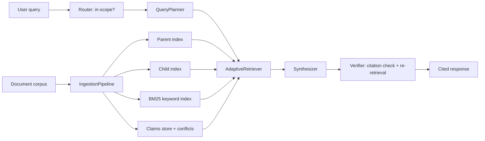

# Architecture Notes

GroundedDoc has two halves: an **ingestion** path that turns a raw document
corpus into searchable, conflict-aware indexes, and a **query** path that uses
those indexes to produce cited, verified answers. Everything is local and
file-based by default, and every query run is traced in MLflow.

## Components at a glance

- **Ingestion engineering.** Structure-aware markdown parsing, a hierarchical
  parent/child index, atomic claim extraction, and cross-document conflict
  detection.
- **Agentic query layer.** A query planner that classifies and decomposes
  questions, adaptive retrieval across vector / BM25 / claims / multi-hop
  strategies, and a citation verifier loop that re-retrieves when a citation
  fails.
- **Evaluation.** MLflow `genai.evaluate` with custom scorers and A/B experiment
  runs, gated in CI.
- **Deployment.** A FastAPI service plus a Cloud Run Dockerfile, designed to run
  on GCP free tiers (~$0/month for portfolio traffic).
- **Privacy-policy extension.** A browser extension backed by `POST /analyze`
  that performs grounded GDPR/PIPEDA review of arbitrary pages.

## Pipeline overview

## Ingestion

1. Parse markdown corpus into sections
2. Build parent summaries + child chunks (hierarchical index)
3. Extract atomic claims and detect cross-document conflicts (SQLite claims store)
4. Embed and persist vectors to `data/index/vector_store.json`
5. Build BM25 indexes for keyword retrieval

## Query Pipeline

1. **Router** — out-of-scope detection
2. **QueryPlanner** — classify query + decompose sub-queries
3. **AdaptiveRetriever** — vector / BM25 / claims / multi-hop routing
4. **Synthesizer** — extractive answer with citations (optional Gemini)
5. **Verifier** — citation check + re-retrieval loop

## Evaluation

- Golden dataset: `grounded_doc_agent/eval/golden_dataset.json`
- MLflow scorers in `grounded_doc_agent/eval/scorers.py`
- CI gate via `.github/workflows/ci.yml`

## Deployment

- API: `api/main.py` (FastAPI)
- Container: `infra/Dockerfile`
- Cloud Run script: `scripts/deploy_cloud_run.sh`
